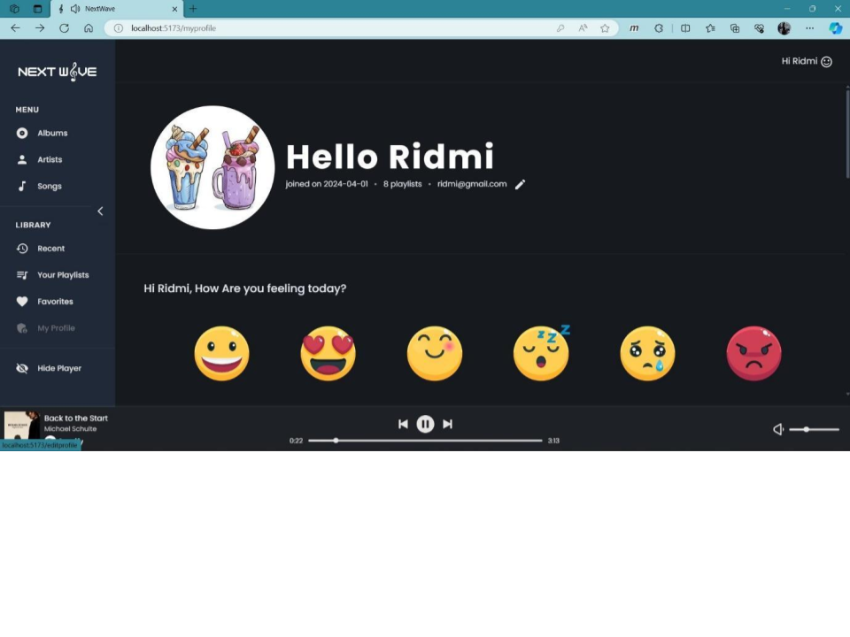
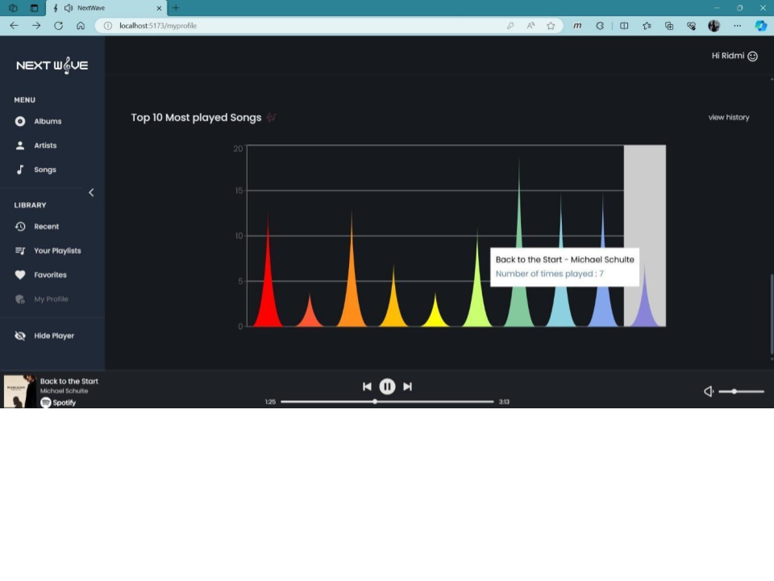
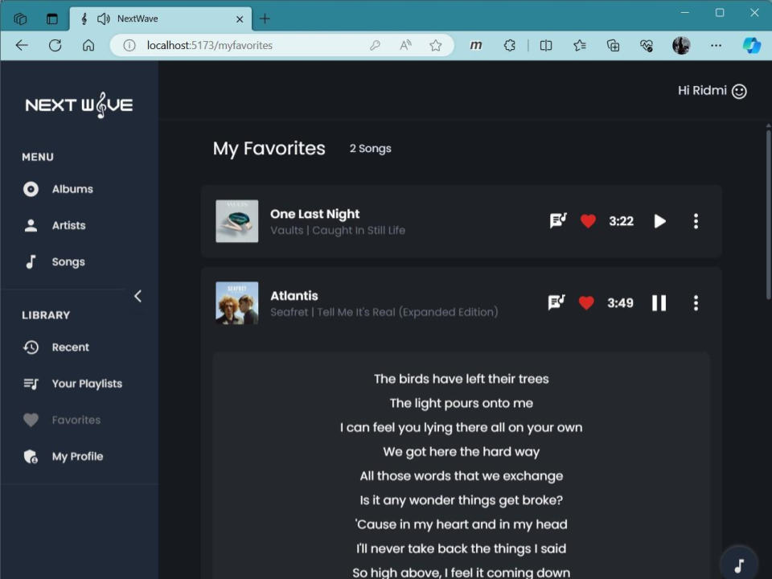
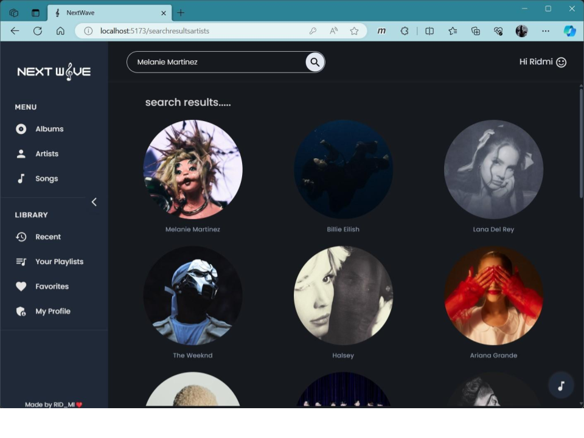

# 🎵 NextWave Music Streaming Web Application    

## 📖 Table of Contents  
1. [Overview](#-overview)  
2. [Features](#-features)  
3. [Built With](#-built-with)  
4. [Installation & Setup](#️-installation--setup)  
5. [UI Screenshots](#-ui-screenshots)  
6. [Database Design](#-database-design)  
7. [Testing](#-testing)  
8. [Future Enhancements](#-future-enhancements)  
9. [License](#-license)  

---

## 📖 Overview  
The **NextWave Music Streaming Web Application** is an interactive and personalized platform for music lovers.  
Developed with the **MERN stack**, it provides **playlist management, lyrics integration, mood-based recommendations, history insights, and secure user profiles** — all within a **modern dark-themed UI**.  

---

## ✨ Features  

### 🔑 User Module  
- Secure registration, login & password reset  
- Profile management with personalization  
- Dashboard showing playlists, moods, favorites  

### 🎶 Music & Playback  
- Search by **song, artist, or album**  
- **Mood-based song suggestions** 🎭  
- Lyrics integration while streaming  
- Full playback controls  

### 🎧 Playlist & Favorites  
- Create, update & delete playlists  
- Add/remove songs from playlists  
- Mark/unmark songs as favorites ❤️  

### 📜 History & Insights  
- Track listening history  
- Clear history anytime  
- Graphs & charts of **top played songs** 📊  

---

## 🛠 Built With  

<p align="center">  
    
    
    
    
    
    
    
</p>  

---

## ⚙️ Installation & Setup  

```bash
# 1. Clone the repository
git clone https://github.com/your-username/nextwave-music.git
cd nextwave-music

# 2. Install dependencies
npm install

# 3. Setup environment variables (.env)
MONGO_URI=your_mongo_uri
SPOTIFY_CLIENT_ID=your_spotify_client_id
SPOTIFY_CLIENT_SECRET=your_spotify_client_secret
EMAIL_USER=your_email
EMAIL_PASS=your_email_password

# 4. Start backend
npm run server

# 5. Start frontend
npm start

# 6. Open in browser
http://localhost:3000
```
---
## 🖼 UI Screenshots  

### 1️⃣ Profile Page – Personalized Dashboard  
  
➡️ Features: Side navigation, mood selection, playlists, recently added favorites.  

---

### 2️⃣ Profile Page – Listening Insights  
  
➡️ Interactive graph showing top played songs & play counts.  

---

### 3️⃣ Lyrics Display & Hidden Player  
  
➡️ View song lyrics while listening; toggle music player visibility.  

---

### 4️⃣ Artist Search Results  
  
➡️ Search artists/albums/songs. Example: “Melanie Martinez”.  

---

## 📊 Database Design  

- **User Collection**: Stores profile, playlists, favorites, authentication.  
- **History Collection**: Stores songs played & play counts.  

📌 Data flow ensures real-time updates to history, favorites, and playlists.  

---

## 🧪 Testing  

- ✔️ User Registration & Authentication  
- ✔️ Search & Playback  
- ✔️ Playlist & Favorites Management  
- ✔️ History Tracking  
- ✔️ Password Reset  

---

## 🚀 Future Enhancements  

- 📱 Mobile App (React Native)  
- 🔄 Offline Playback Mode  
- 👥 Social Playlist Sharing  
- 🤖 AI-driven Smart Recommendations  

---

## 📜 License  

This project is licensed under the **MIT License**.  
You are free to use, modify, and distribute it.

